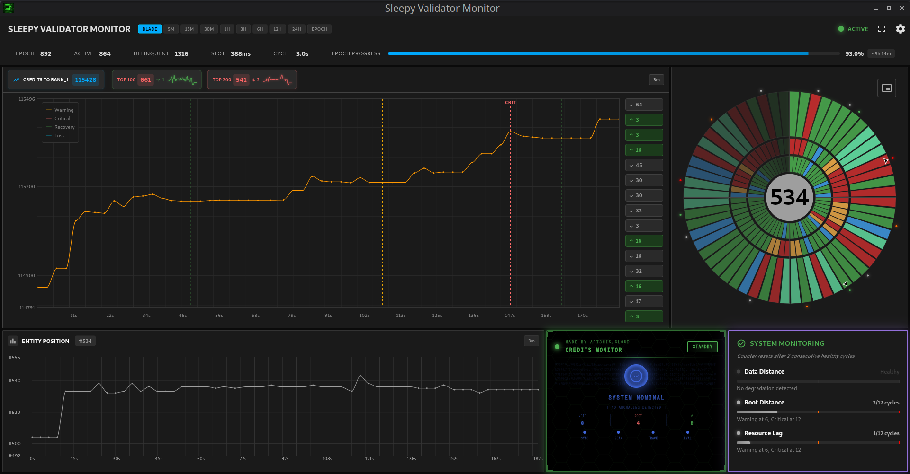

# SLEEPY UI

**Solana Validator Real-Time Monitoring with Sub-3-Second Incident Response**

[](https://github.com/a3mc/sleepy_ui/actions/workflows/ci.yml)
[](https://github.com/a3mc/sleepy_ui/actions/workflows/release.yml)
[](https://github.com/a3mc/sleepy_ui/releases)
[](https://flutter.dev)
[](LICENSE)

[](#platforms)
[](https://dart.dev)

<div align="center">

<table>
<tr>
<td align="center"><b>Desktop Dashboard Main Screen</b></td>
</tr>
<tr>
<td></td>
</tr>
</table>

</div>

---

## Core Concept

During over five years of operating Solana validators, we have responded to multiple failover and disaster recovery events. These incidents are inevitable and demand immediate engineering reaction. At 350ms block time, every second matters, delayed recovery incurs measurable resource loss. Infrastructure complexity requires sharp mindfulness to make absolutely correct decisions under pressure.

Standard monitoring tools lack the required granularity. As for example Prometheus operates at 1-second intervals under optimal conditions, but this configuration is discouraged at scale and still insufficient for sub-second network dynamics. Grafana standard dashboard reload can go as minimum as 5 secon and not only this is too slow, but also requires manual intervention to refresh the view. Alerting systems typically aggregate over minutes to avoid alert fatigue, which is counterproductive during critical incidents.

**Requirements**:
* Sufficient granularity to resolve incident timelines accurately with no doubt or assumptions
* Sub-3-second evaluation time for on-call engineers responding to alerts
* Zero-latency interface: all critical data visible immediately without scrolling, clicking, or buttons pressing
* Preferable 1-second snapshot granularity minimum

This approach provides instant situational awareness: incident onset, duration, severity, and critically confirmation of operational recovery.

---

## Technical Specifications

**Framework**: Flutter 3.38.5+ (Dart 3.10.4+)  
**State Management**: Riverpod 2.6.1  
**Data Transport**: SSE (Server-Sent Events)  
**Authentication**: Bearer token via flutter_secure_storage  
**Platforms**: Android (SDK 21+), iOS (12.0+), Linux (GTK3), macOS (10.14+), Windows (10 1903+)

**Developer**: Matsuro Hadouken  
**Organization**: ART3MIS.CLOUD  
**Contact**: team@art3mis.cloud

### Backend repository access requires authorization. Send us an email to be authorized.

---

## Capabilities

**Monitoring Features**:
- Real-time SSE stream processing with automatic reconnection
- Vote distance and root distance tracking
- Credits delta accumulation monitoring
- Credits gap analysis: rank1, top100, top200 deltas
- Historical data retrieval (5m to full epoch)
- Circular blade visualization (60-snapshot rolling buffer)

**Alert System**:
- Credits loss detection with multi-stage validation pipeline
- Temporal alert thresholds (Warning/Critical)
- Epoch boundary markers
- Alert state transitions logged with event IDs

**Performance**:
- Sub-3-second incident detection latency
- Buffer capacity: 60 snapshots
- Historical data sampling when dataset exceeds 300 points

---

## Deployment

### Prerequisites

- Flutter SDK 3.38.5+
- Dart SDK 3.10.4+
- Platform-specific toolchains (see platform setup guides)

### Build

```bash
git clone https://github.com/a3mc/sleepy_ui.git
cd sleepy_ui
flutter pub get
flutter run --release
```

### Configuration

Settings accessible via gear icon:
- Backend endpoint URL (HTTP/HTTPS)
- Bearer token for API authentication
- Sleep prevention toggle (desktop: Linux/macOS/Windows; mobile: Android/iOS automatic when app active)

Credential storage:
- Android: Android Keystore (encrypted)
- Linux: JSON file at `~/.config/sleepy_ui/config.json` (plain text, 0600 permissions)
- macOS: JSON file at `~/Library/Application Support/sleepy_ui/config.json` (plain text, OS ACL)
- Windows: JSON file at `%APPDATA%\sleepy_ui\config.json` (plain text, OS ACL)

---

## Testing

```bash
flutter test                    # Run test suite (45 tests)
flutter test --coverage         # Generate coverage report
flutter analyze --fatal-infos   # Static analysis
dart format --set-exit-if-changed .
```

---

## Platform Build Instructions

Build proceres are LLM generated and maintained in separate documentation files:

- [docs/RELEASE_BUILD.md](docs/RELEASE_BUILD.md) - Build commands for all platforms
- [docs/ANDROID_SETUP.md](docs/ANDROID_SETUP.md) - Android SDK configuration
- [docs/MACOS_SETUP.md](docs/MACOS_SETUP.md) - Xcode setup
- [docs/WINDOWS_SETUP.md](docs/WINDOWS_SETUP.md) - Visual Studio setup

---

## Dependencies

Core dependencies (exact versions locked in pubspec.yaml):

- `flutter_riverpod: 2.6.1` - State management
- `fl_chart: 0.69.0` - Chart rendering
- `http: 1.2.2` - REST API
- `flutter_secure_storage: 9.2.2` - Credential storage
- `intl: 0.19.0` - Date/time formatting

All dependencies audited before inclusion. No version ranges permitted.

---

## Operational Notes

**Reconnection Logic**:
- Exponential backoff: 2s, 4s, 8s, 16s, 32s (max 5 attempts)
- Timeout per request: 30s
- Buffer preservation during reconnection attempts
- Connection state visible in header bar

**Memory Constraints**:
- Live buffer: 60 snapshots
- Historical data: sampled if >300 points
- Chart rendering: RepaintBoundary optimization
- Android: Scudo allocator 256MB limit applies to Dart heap

**Time Synchronization**:
- Server timestamps used for all time-series data (prevents client clock skew)
- Historical data beyond live buffer retrieved from backend API
- Live buffer: 60 snapshots (duration depends on backend snapshot rate)

---

## Known Limitations

* Flutter Linux embedder warnings on window close (cosmetic, non-blocking)

---

## Contributing

Code contributions accepted via pull requests. Requirements:

- Follow Effective Dart style guide
- No emojis in code or comments (exception: CLI output `[✓]` `[✗]`)
- Pass `flutter analyze --fatal-infos`
- Maintain test coverage for provider logic
- Exact dependency versions only (no semver ranges)

---

## License

MIT License - see [LICENSE](LICENSE)

---

## Support

**Issues**: [GitHub Issues](https://github.com/a3mc/sleepy_ui/issues)  
**Email**: team@art3mis.cloud  
**Website**: [https://art3mis.cloud](https://art3mis.cloud)

---

Made by ART3MIS.CLOUD
